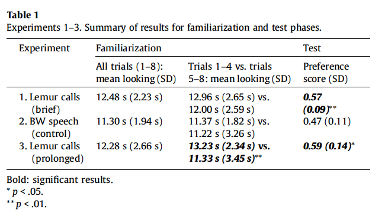

#### Article ID: Wzqlp
#### Pilot: Richie Lenne
#### Co-pilot: Bria Long
#### Start date: Oct 21 2017
#### End date: Nov 17 2017
#### Final verification: Tom Hardwicke
#### Date: Nov 17 2017
-------

#### Methods summary: 

14 Infants were exposed to a novel vocalization (Lemur noises). They were then familiarized with a set of dinosaur images (without noise in the background). This was followed by a testing phase in which there were two side-by-side images—one of familiar category (dinosaur) and one of a novel category (fish)—presented for 20 seconds with the Lemur vocalizations playing in the background. Relative time spent looking at the novel image as opposed to the familiar one was coded. They hypothesized that infants would spend more time looking at the novel image, when a novel vocalization was present. However, there was no control group vocalization in experiment 1. The control group is reported in Experiment 2, which is beyond the scope of this report. 

------

#### Target outcomes: 

For this article you should focus on the findings of Experiment 1 reported in section 2.1.3. and section 2.2. Specifically, you should attempt to reproduce all descriptive and inferential analyses reported in the text below and associated tables/figures:

> 2.1.3. Coding and analysis

> Infants' looking time served as our dependent measure. Infants' left-right eye gaze directions were coded frame-by-frame by trained coders, blind to the hypotheses. For the Familiarization Phase, we coded infants' looking time for each individual trial. We then calculated their mean looking time across all 8 familiarization trials, as well as their mean looking time for familiarization trials 1-4 and 5-8 (see Table 1). For the Test Phase, we coded infants' first 10 s of looking to the test images, and then calculated a Preference Score (looking time to novel test image/looking time to both test images combined) (see Table 1). A preliminary analysis revealed that infants' Preference Scores at test were not related to their gender, age, or looking time during familiarization. In addition, there was no change in infants' looking over the first and last 4 familiarization trials, t(13) = 1.31, p = 0.213 (see Table 1).

> 2.2. Results

> This exposure manipulation had a dramatic effect: Infants revealed a robust preference for the novel test image, M = 0.57, SD = 0.09; t(13) = 3.12, p = 0.008, d = 0.78, indicating that they successfully formed an object category (Fig. 2). Their success stands in sharp contrast to infants' failure with no such exposure, at an age after which they had tuned out lemur vocalizations (Ferry et al., 2013). Thus, mere exposure to lemur vocalizations, even briefly, is sufficient to permit infants to reinstate a developmentally prior link between this signal and object categorization.

------

```{r global_options, include=FALSE}
knitr::opts_chunk$set(echo=TRUE, warning=FALSE, message=FALSE)

# prepare an empty report object, we will update this each time we run compareValues2()
reportObject <- data.frame("Article_ID" = NA, "valuesChecked" = 0, "eyeballs" = 0, "Total_df" = 0, "Total_p" = 0, "Total_mean" = 0, "Total_sd" = 0, "Total_se" = 0, "Total_ci" = 0, "Total_bf" = 0, "Total_t" = 0, "Total_F" = 0, "Total_es" = 0, "Total_median" = 0, "Total_irr" = 0, "Total_r" = 0, "Total_z" = 0, "Total_coeff" = 0, "Total_n" = 0, "Total_x2" = 0, "Total_other" = 0, "Insufficient_Information_Errors" = 0, "Decision_Errors" = 0, "Major_Numerical_Errors" = 0, "Minor_Numerical_Errors" = 0, "Major_df" = 0, "Major_p" = 0, "Major_mean" = 0, "Major_sd" = 0, "Major_se" = 0, "Major_ci" = 0, "Major_bf" = 0, "Major_t" = 0, "Major_F" = 0, "Major_es" = 0, "Major_median" = 0, "Major_irr" = 0, "Major_r" = 0, "Major_z" = 0, "Major_coeff" = 0, "Major_n" = 0, "Major_x2" = 0, "Major_other" = 0, "affectsConclusion" = NA, "error_typo" = 0, "error_specification" = 0, "error_analysis" = 0, "error_data" = 0, "error_unidentified" = 0, "Author_Assistance" = NA, "resolved_typo" = 0, "resolved_specification" = 0, "resolved_analysis" = 0, "resolved_data" = 0, "correctionSuggested" = NA, "correctionPublished" = NA)
```

## Step 1: Load packages

```{r}
library(tidyverse) # for data munging
library(knitr) # for kable table formating
library(haven) # import and export 'SPSS', 'Stata' and 'SAS' Files
library(readxl) # import excel files
library(CODreports) # custom report functions
```

## Step 2: Load data

```{r}
dat <- read_csv("data/data.csv")
```

## Step 3: Tidy data

```{r}
# create dataset for experiment 1 data.
dat1 <- dat %>% filter(Experiment==1)
head(dat1)
```

## Step 4: Run analysis

### Pre-processing

```{r}
# create familarization score for all 8 trials by taking mean of fam score 1-4 and fam score 5-8.
dat1$`Fam1-8 (s)` <- dat1 %>% select(`Fam1-4 (s)`,`Fam5-8 (s)`) %>% rowMeans()
```

### Descriptive statistics  

Let's try to reproduce table 1 (Experiment 1 only i.e., top row):



```{r}
# Table 1 
sumdat <- dat1 %>% 
  summarize(mean_1_8 = mean(`Fam1-8 (s)`),
              sd_1_8 =   sd(`Fam1-8 (s)`),
            mean_1_4 = mean(`Fam1-4 (s)`),
              sd_1_4 =   sd(`Fam1-4 (s)`),
            mean_5_8 = mean(`Fam5-8 (s)`),
              sd_5_8 =   sd(`Fam5-8 (s)`)) 

sumdat %>%
  kable(digits = 2)

reportObject <- compareValues2(reportedValue = "12.48", obtainedValue = sumdat$mean_1_8, valueType = 'mean')
reportObject <- compareValues2(reportedValue = "2.23", obtainedValue = sumdat$sd_1_8, valueType = 'sd')

reportObject <- compareValues2(reportedValue = "12.96", obtainedValue = sumdat$mean_1_4, valueType = 'mean')
reportObject <- compareValues2(reportedValue = "2.65", obtainedValue = sumdat$sd_1_4, valueType = 'sd')

reportObject <- compareValues2(reportedValue = "12.00", obtainedValue = sumdat$mean_5_8, valueType = 'mean')
reportObject <- compareValues2(reportedValue = "2.59", obtainedValue = sumdat$sd_5_8, valueType = 'sd')

# NB - preference score addressed below by comparing to main text.
```

### Inferential statistics

> A preliminary analysis revealed that infants' Preference Scores at test were not related to their gender, age, or looking time during familiarization.  

NB - we initially encountered an "insufficient information error" because the tests which were run were not reported. We contacted the author and they informed us that "My preliminary analyses involved (1) running a 2-tailed t-test to compare the Preference Scores of males and females (not significantly different), (2) running a correlation between Preference Scores and age (not significant), and (3) running a correlation between Preference Scores and looking time during familiarization (not significant)."

```{r}
pref_F <- dat1 %>% filter(`Sex (1=F, 2=M)` == 1) %>% pull(`PreferenceScore_10s (proportion)`)
pref_M <- dat1 %>% filter(`Sex (1=F, 2=M)` == 2) %>% pull(`PreferenceScore_10s (proportion)`)

t.test(pref_F, pref_M, var.equal = T)
```

Point 1 confirmed.

```{r}
cor.test(dat1$`Age (mos)`, dat1$`PreferenceScore_10s (proportion)`)
```

Point 2 confirmed.

```{r}
cor.test(dat1$`FamLookingProp (proportion)` , dat1$`PreferenceScore_10s (proportion)`)
```

Point 3 confirmed.

> In addition, there was no change in infants' looking over the first and last 4 familiarization trials, t(13) = 1.31, p = 0.213 (see Table 1).

```{r}
# No numerical errors here
famLookingTime <- t.test(dat1$`Fam1-4 (s)`,dat1$`Fam5-8 (s)`, paired=TRUE)
reportObject <- compareValues2(reportedValue = "13", obtainedValue = famLookingTime$parameter, valueType = 'df')
reportObject <- compareValues2(reportedValue = "1.31", obtainedValue = famLookingTime$statistic, valueType = 't')
reportObject <- compareValues2(reportedValue = "0.213", obtainedValue = famLookingTime$p.value, valueType = 'p')
```

> This exposure manipulation had a dramatic effect: Infants revealed a robust preference for the novel test image, M = 0.57, SD = 0.09; t(13) = 3.12, p = 0.008, d = 0.78, indicating that they successfully formed an object category (Fig. 2). Their success stands in sharp contrast to infants' failure with no such exposure, at an age after which they had tuned out lemur vocalizations (Ferry et al., 2013). Thus, mere exposure to lemur vocalizations, even briefly, is sufficient to permit infants to reinstate a developmentally prior link between this signal and object categorization.

NB - initially unclear what type of t-test was used. Author informed us this was a one-sample t-test comparing to chance (0.5). Additionally we encounted some minor numerical errors and a major error for the p-value. The authors also informed us that the reported values are based on analysis of the raw data whereas the data file that has been shared contains rounded values. The analysis below is our inital attempt.
  
```{r}
# # summarize mean and sd of preference scores
# novelPref <-dat1 %>% 
#   summarize(mean = mean(`PreferenceScore_10s (proportion)`),
#               sd = sd(`PreferenceScore_10s (proportion)`))
# 
# # compare means and sd
# reportObject <- compareValues2(reportedValue = "0.57", obtainedValue = novelPref$mean, valueType = 'mean')
# reportObject <- compareValues2(reportedValue = "0.09", obtainedValue = novelPref$sd, valueType = 'sd')
# 
# # one sample t-test with .5 as null hypothesis.
# novelPrefStats=t.test(dat1$`PreferenceScore_10s (proportion)`, mu=.5, alternative = "two.sided")
# 
# reportObject <- compareValues2(reportedValue = "13", obtainedValue = novelPrefStats$parameter, valueType = 'df')
# reportObject <- compareValues2(reportedValue = "3.12", obtainedValue = novelPrefStats$statistic, valueType = 't')
# 
# # Major numerical error in p-value
# reportObject <- compareValues2(reportedValue = "0.008", obtainedValue = novelPrefStats$p.value, valueType = 'p')
# 
# # No error in cohen's d
# chanceVal=.5
# cohensD=(novelPref$mean  - chanceVal)/novelPref$sd;
# reportObject <- compareValues2(reportedValue = "0.78", obtainedValue = cohensD, valueType = 'es')
```
The authors sent us the data file containing the raw (i.e., unrounded) data. We will use this now:

```{r}
d.unrounded <- read_csv("authorAssistance/ExposureCognition_unrounded.csv")
d.unrounded <- d.unrounded %>% filter(Experiment == 1) # select experiment 1 only

# summarize mean and sd of preference scores
novelPref <-d.unrounded %>% 
  summarize(mean = mean(`PreferenceScore_10s (proportion)`),
              sd = sd(`PreferenceScore_10s (proportion)`))

# compare means and sd
reportObject <- compareValues2(reportedValue = "0.57", obtainedValue = novelPref$mean, valueType = 'mean')
reportObject <- compareValues2(reportedValue = "0.09", obtainedValue = novelPref$sd, valueType = 'sd')

# one sample t-test with .5 as null hypothesis.
novelPrefStats=t.test(d.unrounded$`PreferenceScore_10s (proportion)`, mu=.5, alternative = "two.sided")

reportObject <- compareValues2(reportedValue = "13", obtainedValue = novelPrefStats$parameter, valueType = 'df')
reportObject <- compareValues2(reportedValue = "3.12", obtainedValue = novelPrefStats$statistic, valueType = 't')

reportObject <- compareValues2(reportedValue = "0.008", obtainedValue = novelPrefStats$p.value, valueType = 'p')

chanceVal=.5
cohensD=(novelPref$mean  - chanceVal)/novelPref$sd;
reportObject <- compareValues2(reportedValue = "0.78", obtainedValue = cohensD, valueType = 'es')
```

## Step 5: Conclusion

The original article states that there were no age or gender difference in preference score, however, doesn't report the test conducted or statistics. We contacted the authors and they informed us which tests which employed.

For the next part of the analysis, we encountered a number of minor numerical errors and then one major error for a t-value. It was also not clear exactly what type of t-test specification had been employed. We contacted the authors and they informed us that this was a one-sample t-test comparing to chance (0.5). Additionally, the outcomes reported in the paper were based on raw data, however, the data file shared actually contains rounded values rather than raw data. The authors send us the data file containing raw unrounded values and we were able to reproduce the reported outcomes with this.

```{r}
reportObject$Article_ID <- "Wzqlp"
reportObject$affectsConclusion <- "no"
reportObject$error_typo <- 0
reportObject$error_specification <- 0
reportObject$error_analysis <- 0
reportObject$error_data <- 0
reportObject$error_unidentified <- 0
reportObject$Author_Assistance <- T
reportObject$resolved_typo <- 0
reportObject$resolved_specification <- 2
reportObject$resolved_analysis <- 0
reportObject$resolved_data <- 1
reportObject$correctionSuggested <- "no"
reportObject$correctionPublished <- F

# decide on final outcome
if(reportObject$Decision_Errors > 0 | reportObject$Major_Numerical_Errors > 0 | reportObject$Insufficient_Information_Errors > 0){
  reportObject$finalOutcome <- "Failure"
  if(reportObject$Author_Assistance == T){
    reportObject$finalOutcome <- "Failure despite author assistance"
  }
}else{
  reportObject$finalOutcome <- "Success"
  if(reportObject$Author_Assistance == T){
    reportObject$finalOutcome <- "Success with author assistance"
  }
}

# save the report object
filename <- paste0("reportObject_", reportObject$Article_ID,".csv")
write_csv(reportObject, filename)
```

## Report Object

```{r, echo = FALSE}
# display report object in chunks
kable(reportObject[2:10], align = 'l')
kable(reportObject[11:20], align = 'l')
kable(reportObject[21:25], align = 'l')
kable(reportObject[26:30], align = 'l')
kable(reportObject[31:35], align = 'l')
kable(reportObject[36:40], align = 'l')
kable(reportObject[41:45], align = 'l')
kable(reportObject[46:51], align = 'l')
kable(reportObject[52:57], align = 'l')
```

## Session information

```{r session_info, include=TRUE, echo=TRUE, results='markup'}
devtools::session_info()
```
