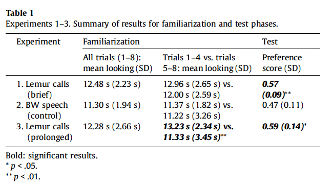

#### Article ID: Wzqlp
#### Pilot: Richie Lenne
#### Co-pilot: Bria Long
#### Start date: 10/21/2017
#### End date: 

-------

#### Methods summary: 

14 Infants were exposed to a novel vocalization (Lemur noises). They were then familiarized with a set of dinosaur images (without noise in the background). This was followed by a testing phase in which there were two side-by-side images—one of familiar category (dinosaur) and one of a novel category (fish)—presented for 20 seconds with the Lemur vocalizations playing in the background. Relative time spent looking at the novel image as opposed to the familiar one was coded. They hypothesized that infants would spend more time looking at the novel image, when a novel vocalization was present. However, there was no control group vocalization in experiment 1. The control group is reported in Experiment 2, which is beyond the scope of this report. 

------

#### Target outcomes: 

For this article you should focus on the findings of Experiment 1 reported in section 2.1.3. and section 2.2. Specifically, you should attempt to reproduce all descriptive and inferential analyses reported in the text below and associated tables/figures:

> 2.1.3. Coding and analysis

> Infants' looking time served as our dependent measure. Infants' left-right eye gaze directions were coded frame-by-frame by trained coders, blind to the hypotheses. For the Familiarization Phase, we coded infants' looking time for each individual trial. We then calculated their mean looking time across all 8 familiarization trials, as well as their mean looking time for familiarization trials 1-4 and 5-8 (see Table 1). For the Test Phase, we coded infants' first 10 s of looking to the test images, and then calculated a Preference Score (looking time to novel test image/looking time to both test images combined) (see Table 1). A preliminary analysis revealed that infants' Preference Scores at test were not related to their gender, age, or looking time during familiarization. In addition, there was no change in infants' looking over the first and last 4 familiarization trials, t(13) = 1.31, p = 0.213 (see Table 1).

> 2.2. Results

> This exposure manipulation had a dramatic effect: Infants revealed a robust preference for the novel test image, M = 0.57, SD = 0.09; t(13) = 3.12, p = 0.008, d = 0.78, indicating that they successfully formed an object category (Fig. 2). Their success stands in sharp contrast to infants' failure with no such exposure, at an age after which they had tuned out lemur vocalizations (Ferry et al., 2013). Thus, mere exposure to lemur vocalizations, even briefly, is sufficient to permit infants to reinstate a developmentally prior link between this signal and object categorization.

------

```{r global_options, include=FALSE}
knitr::opts_chunk$set(echo=TRUE, warning=FALSE, message=FALSE)
```

## Step 1: Load packages

```{r}
library(tidyverse) # for data munging
library(knitr) # for kable table formating
library(haven) # import and export 'SPSS', 'Stata' and 'SAS' Files
library(readxl) # import excel files
library(CODreports) # custom report functions
```

## Step 2: Load data

```{r}
dat <- read_csv("data/data.csv")
```

## Step 3: Tidy data

```{r}
dat
# create dataset for with experiment 1 data.
dat1 <- dat %>% filter(Experiment==1)
```

## Step 4: Run analysis

### Pre-processing

```{r}
# create familarization score for all 8 trials by taking mean of fam score 1-4 and fam score 5-8.
dat1$`Fam1-8 (s)` <- dat1 %>% select(`Fam1-4 (s)`,`Fam5-8 (s)`) %>% rowMeans()
```

### Descriptive statistics  

```{r}
# Table 1 
dat1 %>% 
  summarize(mean_1_8 = mean(`Fam1-8 (s)`),
              sd_1_8 =   sd(`Fam1-8 (s)`),
            mean_1_4 = mean(`Fam1-4 (s)`),
              sd_1_4 =   sd(`Fam1-4 (s)`),
            mean_5_8 = mean(`Fam5-8 (s)`),
              sd_5_8 =   sd(`Fam5-8 (s)`)) %>%
  kable(digits = 2)

# Minor error in mean of trial 1-4 (## probably just rounding errors here)
compareValues(reportedValue = 12.96, obtainedValue = 12.97, isP = F)

# Minor error in sd of trial 1-4
compareValues(reportedValue = 2.65, obtainedValue = 2.64, isP = F)
```



### Inferential statistics
> A preliminary analysis revealed that infants' Preference Scores at test were not related to their gender, age, or looking time during familiarization.  

INSUFFICIENT INFORMATION ERROR  
They don't report which tests were run nor test statistics.


> In addition, there was no change in infants' looking over the first and last 4 familiarization trials, t(13) = 1.31, p = 0.213 (see Table 1).

```{r}
# No numerical errors here
famLookingTime <- t.test(dat1$`Fam1-4 (s)`,dat1$`Fam5-8 (s)`, paired=TRUE)
compareValues(reportedValue = 1.31, obtainedValue = famLookingTime$statistic, isP = F)
compareValues(reportedValue = .213, obtainedValue = famLookingTime$p.value, isP = T)

```

> This exposure manipulation had a dramatic effect: Infants revealed a robust preference for the novel test image, M = 0.57, SD = 0.09; t(13) = 3.12, p = 0.008, d = 0.78, indicating that they successfully formed an object category (Fig. 2). Their success stands in sharp contrast to infants' failure with no such exposure, at an age after which they had tuned out lemur vocalizations (Ferry et al., 2013). Thus, mere exposure to lemur vocalizations, even briefly, is sufficient to permit infants to reinstate a developmentally prior link between this signal and object categorization.
  
```{r}
# summarize mean and sd of preference scores
novelPref <-dat1 %>% 
  summarize(mean = mean(`PreferenceScore_10s (proportion)`),
              sd =   sd(`PreferenceScore_10s (proportion)`))

# compare means and sd
compareValues(reportedValue = .57, obtainedValue = novelPref$mean, isP = F)
compareValues(reportedValue = .09, obtainedValue = novelPref$sd, isP = F)

# one sample t-test with .5 as null hypothesis.
novelPrefStats=t.test(dat1$`PreferenceScore_10s (proportion)`, mu=.5, alternative = "two.sided")

# Minor numerical error in t-value
compareValues(reportedValue = 3.12, obtainedValue = novelPrefStats$statistic, isP = F)

# Major numerical error in p-value
compareValues(reportedValue = 0.008, obtainedValue = novelPrefStats$p.value, isP = T)

# No error in cohen's d
chanceVal=.5
cohensD=(novelPref$mean  - chanceVal)/novelPref$sd;
compareValues(reportedValue = .78, obtainedValue = cohensD, isP = F)
```

## Step 5: Conclusion

```{r}
codReport(Report_Type = 'joint',
          Article_ID = 'Wzqlp', 
          Insufficient_Information_Errors = 1,
          Decision_Errors = 0, 
          Major_Numerical_Errors = 1, 
          Minor_Numerical_Errors = 3)
```

The original study states that there were no age or gender difference in preference score, however, doesn't report the test conducted or statistics. We classified this as an insufficient information error. For the next part of the analysis, it is unclear why there is an error in the t and p value, considering Cohen's d, mean, and sd are correct.

```{r session_info, include=TRUE, echo=TRUE, results='markup'}
devtools::session_info()
```
